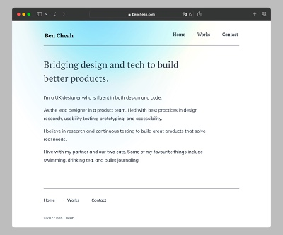

# Ben Cheah - Portfolio Website

[](docs/readme-website-preview.jpg)

This is the source code for my portfolio website. You can see it live on [bencheah.com](https://bencheah.com).

## What I Used

- [Gatsby](https://www.gatsbyjs.com/) as the base framework for this web app. Lots of nice modern features, including server-side rendering, image optimization, and page preloading.
- [Tailwind](https://github.com/tailwindlabs/tailwindcss), which makes it fast to prototype layouts and style the website.
- [Fontsource](https://fontsource.org/) to self-host the open source fonts used on this website.
- [Styled Icons](https://github.com/styled-icons/styled-icons), which makes it easy to import and use icon packs like Font Awesome.
- Gatsby plugins for processing markdown, adding website metadata, and importing SVGs.

## Setup

To run this project, clone the repo. Then run:

```
$ yarn install
$ yarn start
```

You can then access the local application at localhost:8000.