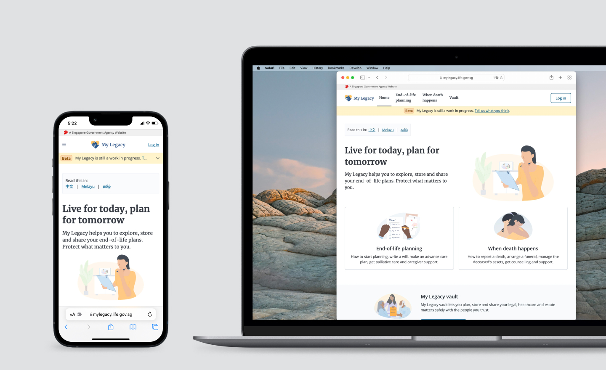
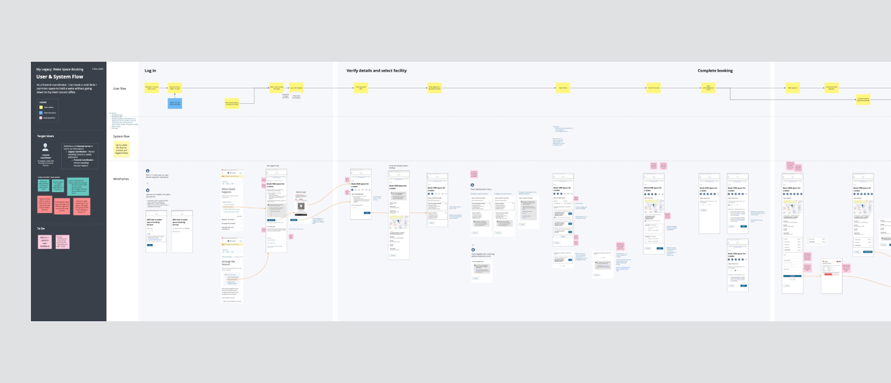
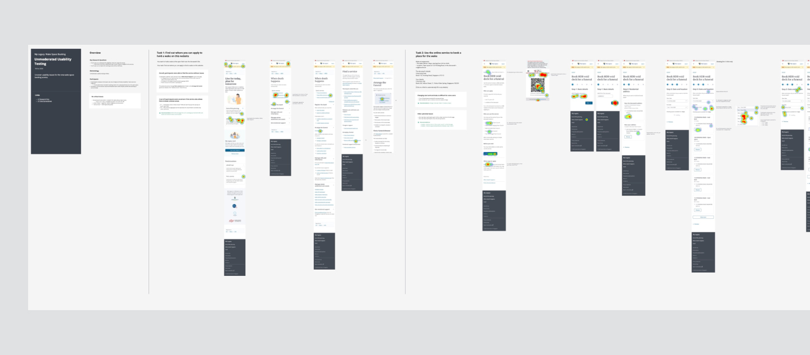
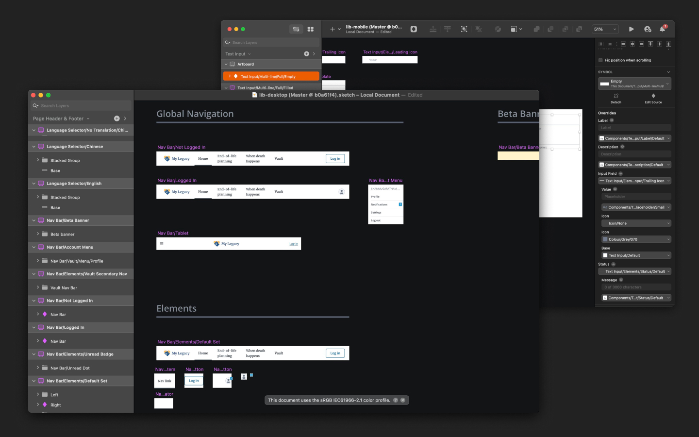
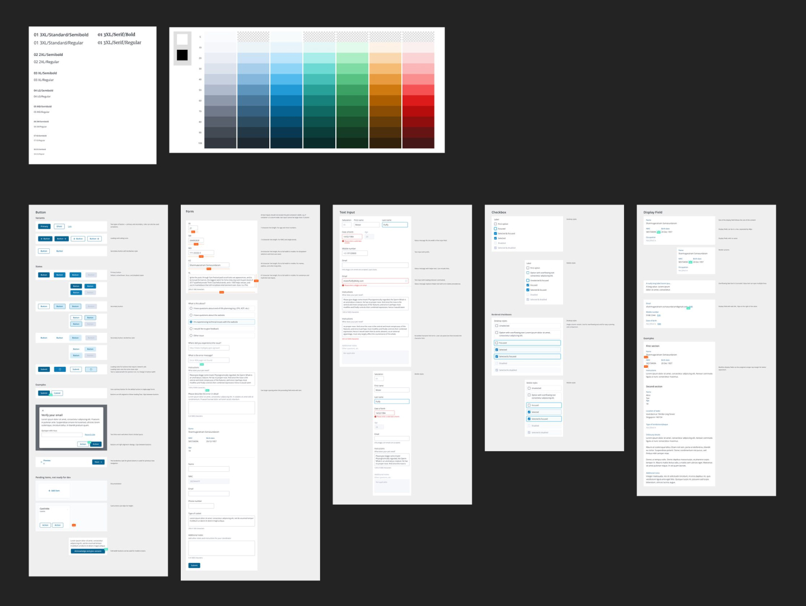
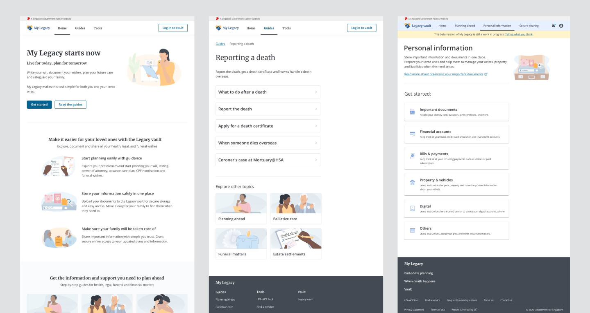
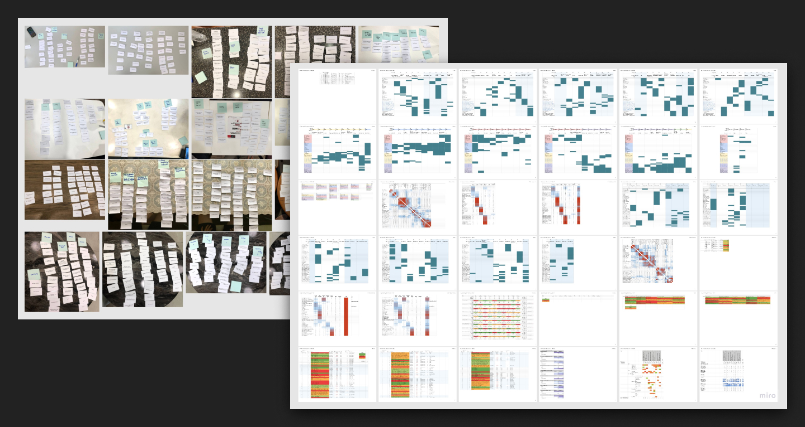
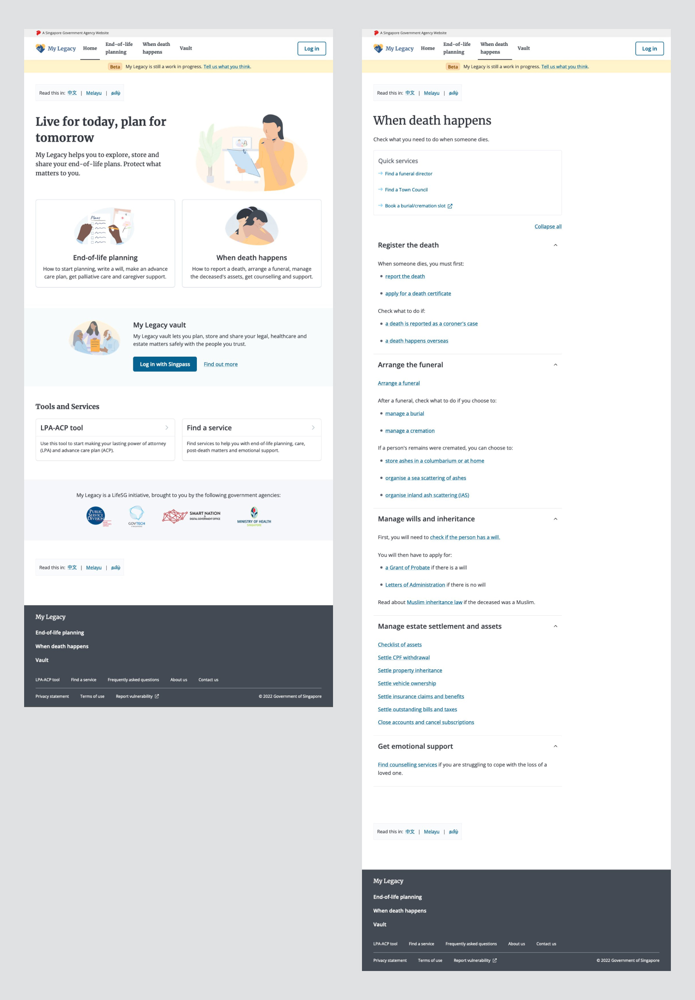
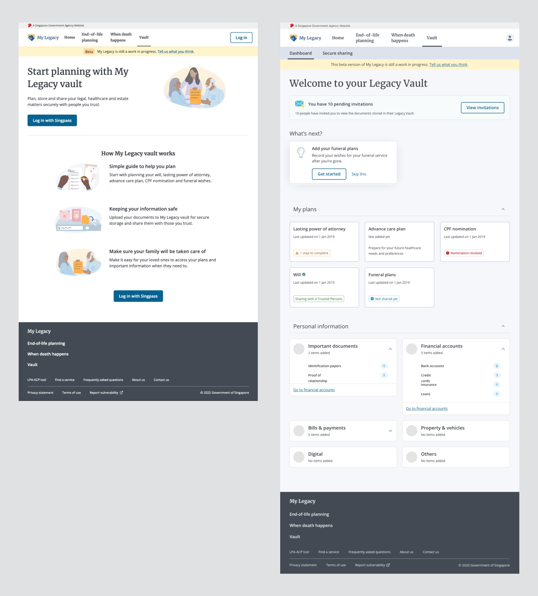

The passing of a loved one is one of the most difficult experiences.

In Singapore, different government agencies handle different parts of death and funeral procedures, which is confusing and tedious for bereaved citizens looking to settle matters quickly and efficiently.

  <a
    href="https://mylegacy.life.gov.sg/"
    target="_blank"
    rel="noreferrer noopener"
  >
    My Legacy
  </a>{' '}
  is a website that guides Singaporeans in matters of end-of-life planning,
  death, funerals and inheritance. It serves as a single touchpoint to bridge
  services across many government agencies.

I was involved in the entire design process, including inception, research, prototyping and UI design. I also led multiple features, including a major redesign of the information architecture.

## Bridging the gap between design and implementation

Ineffective design handover is a common problem for designers working in agile teams. When the design specs are not feasible or complete, it takes additional time for both designers and developers to fill in the gaps or worse, come up with a different solution.

Throughout my time working in My Legacy, I continuously sought feedback and refined our design process. We included our developers and stakeholders early in our design process, when we start mapping flows and sketch lo-fi wireframes.

When we started working from home during the pandemic, I looked for digital collaborative tools and set up templates for the team to easily adapt to our remote working process.

As a result, we were able to produce more diverse ideas, more feasible solutions, weed out critical issues and dependencies earlier, have better alignment and clearer communication.

## Building the foundation

My Legacy was going to be a large and complex project. As it scaled up, we anticipated problems of inconsistent styles and components, which would increase code complexity and cost us time to maintain.

I set up the design system with another designer, and also created the Sketch library symbols that would allow any designer to mock up screens with little effort.

We wanted to build great usability and accessibility into our website, especially since our users include older people and bereaved people who have limited thinking capacity.

This factored into our design choices, which our target users responded well to during testing — larger font sizes, large target sizes and high colour contrast (minimum WCAG AA).

## Redesigning the information architecture

During usability testing, we found critical problems in the information architecture (IA), one of which was that users were confused by how the guides and the vault were organised in separate sections. As we planned to expand the website, the IA might not be able to accommodate new additions, especially with the existing issues.

We weren’t sure if it’s possible to merge the guides and vault sections. To better understand our users’ mental model, we conducted card sorting and tree testing to learn how they naturally group the different parts of the website.

What we found out was that splitting the two sections could still work. We ultimately decided on the split model because it was simpler to implement and more suitable for the upcoming features in our roadmap.

We also uncovered more issues in the IA that we weren’t aware of. We learnt what exactly to fix and how, which cut down on guesswork (whether we should create better categories or reduce the number of categories). Our team and our stakeholders made faster decisions together, supported by evidence rather than opinions.

This is why research and testing is an integral part of our process — it allows us to design with precision and confidence.

