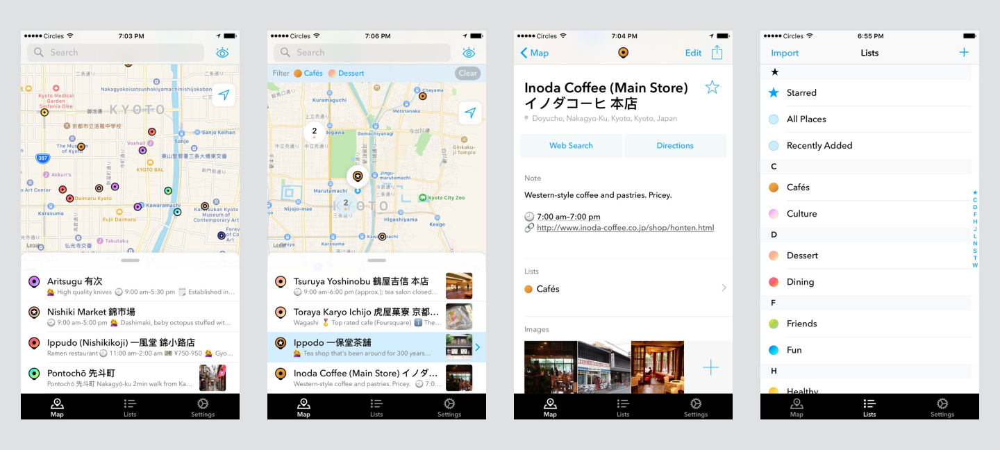

import Youtube from '../../src/components/youtube-embed';

As a someone who likes to plan, I tend to save a lot of places with notes before going on a trip. I built this iPhone app for travellers who needed a personal map of their own, that they can use on the move without distractions, and without the clutter on apps like Google Maps.

The map shows just what you need — pin locations, place names, notes and thumbnails — so you can find what you need without opening each place to see the details.

Users can also personalise their pins with colours and organise their map with lists.

<Youtube
  width="406"
  height="720"
  maxWidth="406"
  src="https://www.youtube.com/embed/_FYxG80TMl8"
  title="Yomap Video Preview"
  vertical={true}
/>
